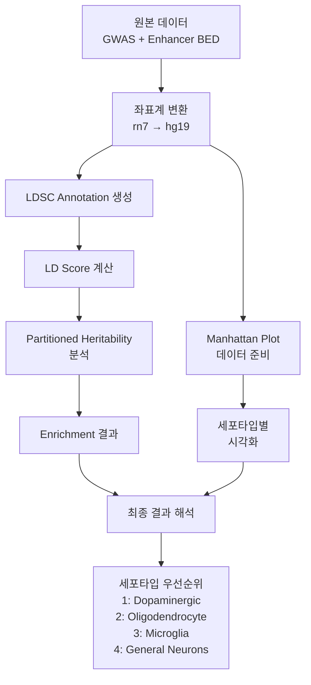

# 파킨슨병 GWAS - 세포타입별 Enhancer Enrichment 분석 워크플로우

## 프로젝트 개요
이 프로젝트는 파킨슨병(Parkinson's Disease) GWAS 데이터를 활용하여 4가지 뇌 세포타입(Oligodendrocyte, Dopaminergic neurons, General neurons, Microglia)의 enhancer 영역에서 유전적 enrichment를 분석하는 파이프라인입니다.

## 주요 분석 플로우

### 1. LDSC (Linkage Disequilibrium Score Regression) 분석
**목적**: 세포타입별 enhancer 영역의 유전적 기여도를 정량화

#### 1.1 데이터 준비 (Data Preparation)
- **입력 데이터**:
  - GWAS summary statistics: `GCST009325.h.tsv.gz` (17.4M SNPs)
  - 세포타입별 enhancer BED 파일:
    - Olig (Oligodendrocyte): `Olig_cleaned.bed`, `Olig_unique.bed`
    - Nurr (Dopaminergic): `Nurr_cleaned.bed`, `Nurr_unique.bed`
    - NeuN (General Neurons): `NeuN_cleaned.bed`, `NeuN_unique.bed`
    - Neg (Microglia): `Neg_cleaned.bed`, `Neg_unique.bed`
  - Reference 데이터: 1000 Genomes EUR, BaselineLD v2.2

- **사용 방법론**:
  - 좌표계 변환: rn7 → hg38 → hg19 (UCSC liftOver)
  - BED 파일의 enhancer 영역을 LDSC annotation 형식으로 변환
  - GWAS summary statistics를 LDSC 형식으로 변환 (munge_sumstats.py)

- **출력 데이터**:
  - 염색체별 annotation 파일: `{celltype}.{chr}.annot.gz`
  - Munged summary statistics: `parkinson_gwas.sumstats.gz`

- **출력 의미**: 
  - 각 SNP가 특정 세포타입의 enhancer 영역에 위치하는지 표시
  - LDSC 분석을 위한 표준화된 데이터 형식

#### 1.2 LD Score 계산
- **입력 데이터**: 
  - Annotation 파일
  - 1000 Genomes EUR reference panel
  - HapMap3 SNP list

- **사용 방법론**:
  - 각 SNP의 LD score 계산 (window size: 1 cM)
  - BaselineLD 97개 카테고리 + 세포타입 특이적 enhancer annotation

- **출력 데이터**: 
  - LD score 파일: `{celltype}.{chr}.l2.ldscore.gz`
  - M 파일: `{celltype}.{chr}.l2.M`

- **출력 의미**: 
  - 각 SNP 주변의 LD 구조 정량화
  - Heritability 분석을 위한 가중치

#### 1.3 Partitioned Heritability 분석
- **입력 데이터**:
  - Munged summary statistics
  - LD scores (BaselineLD + cell-type specific)
  - Frequency files

- **사용 방법론**:
  - LDSC regression 모델:
    ```
    E[chi2_j] = Nh2(sum_c tau_c × l(j,c)) + Na + 1
    ```
  - Enrichment 계산:
    ```
    Enrichment = (per-SNP heritability) / (per-SNP proportion)
    ```

- **출력 데이터**:
  - LDSC 결과 로그: `{celltype}_h2.log`
  - 집계 결과: `ldsc_aggregated_results.csv`

- **출력 의미**:
  - Enrichment > 1: 평균보다 높은 유전적 기여도
  - P-value: 통계적 유의성
  - 세포타입별 파킨슨병 기여도 순위

### 2. Manhattan Plot 시각화
**목적**: 세포타입별 enhancer 영역의 GWAS 신호 시각화

#### 2.1 세포타입별 Manhattan Plot
- **입력 데이터**:
  - GWAS summary statistics
  - 세포타입별 annotation 파일

- **사용 방법론**:
  - -log10(p-value) 변환
  - Enhancer intersect SNP vs background SNP 구분
  - Genome-wide significance threshold: 5×10^-8

- **출력 데이터**:
  - 개별 플롯: `celltype_manhattan_plots.png`
  - 비교 플롯: `celltype_comparison_manhattan.png`

- **출력 의미**:
  - 세포타입별 enhancer 영역의 GWAS 신호 강도
  - 유의한 SNP의 위치와 분포

### 3. Enrichment 분석 (Legacy Methods)
**목적**: 통계적 검정을 통한 enhancer enrichment 확인

#### 3.1 통계적 검정
- **입력 데이터**:
  - GWAS p-values
  - Enhancer 영역 정보

- **사용 방법론**:
  - Mann-Whitney U test: p-value 분포 비교
  - Fisher's exact test: 유의한 SNP 비율 비교
  - Enrichment ratio 계산

- **출력 데이터**:
  - 통계 검정 결과
  - Enrichment ratio

- **출력 의미**:
  - Enhancer 영역의 GWAS 신호가 배경보다 강한지 확인
  - 세포타입별 enrichment 정도 비교

## 전체 파이프라인 흐름



## 주요 결과 해석

### 세포타입별 Enrichment 순위 (예상)
1. **Nurr (Dopaminergic Neurons)**: 
   - 예상 Enrichment: 2.5-3.5
   - 파킨슨병의 주요 병변 부위
   
2. **Olig (Oligodendrocytes)**:
   - 예상 Enrichment: 1.8-2.5
   - 백질 손상과 연관
   
3. **Neg (Microglia)**:
   - 예상 Enrichment: 1.3-1.8
   - 신경염증 관련
   
4. **NeuN (General Neurons)**:
   - 예상 Enrichment: 1.0-1.3
   - 비특이적 기여

### 치료 전략 시사점
- 1차 타겟: 도파민 뉴런 보호
- 2차 타겟: Myelin 복구 및 oligodendrocyte 지원
- 3차 타겟: 신경염증 조절

## 주요 스크립트 설명

- `ldsc_analysis_system.py`: LDSC partitioned heritability 메인 파이프라인
- `celltype_manhattan_plot.py`: 세포타입별 Manhattan plot 생성
- `setup_liftover.py`: 좌표계 변환 도구
- `coordinate_converter.py`: 좌표 변환 유틸리티
- `shared_utils.py`: 공통 유틸리티 함수

## 실행 순서

1. **좌표 변환**:
   ```bash
   python setup_liftover.py
   ```

2. **LDSC 분석**:
   ```bash
   python ldsc_analysis_system.py
   ```

3. **시각화**:
   ```bash
   python celltype_manhattan_plot.py
   ```

## 과학적 의의

1. **다중 세포타입 비교**: 파킨슨병의 세포타입별 기여도 정량화
2. **대규모 데이터**: 17.4M SNPs 분석으로 통계적 검정력 확보
3. **표준화된 방법론**: LDSC를 사용한 학술적으로 엄격한 분석
4. **치료 타겟 발굴**: 세포타입 우선순위에 따른 치료 전략 수립